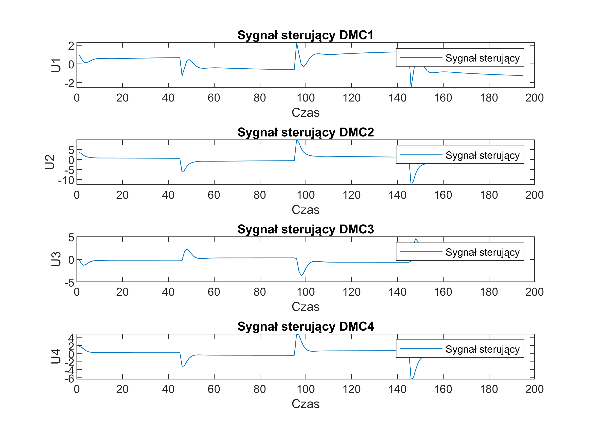
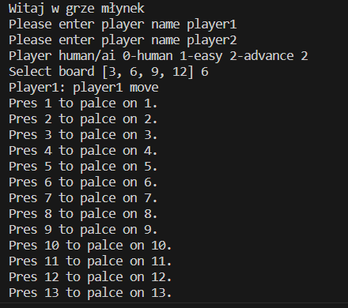
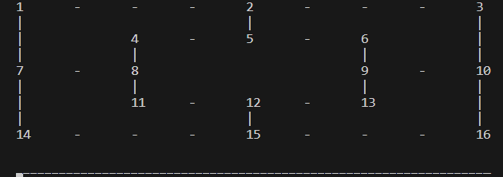
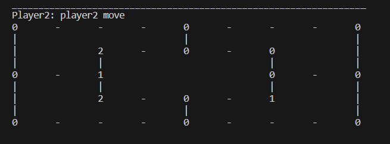
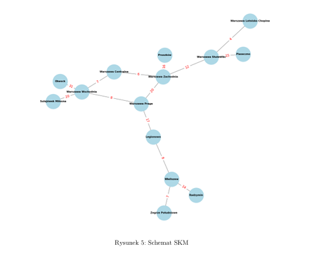
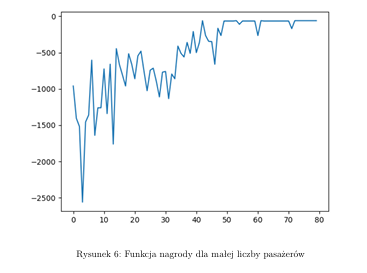

# Cześć, jestem Marek Bogiel!
Jestem studentem automatyki i robotyki na Politechnice Warszawskiej.

## Projekty studenckie
-  [Regulatory DMC](#regulatory-dmc)  
- [Gra planszowa Młynek](#gra-planszowa-młynek)
- [Baza danych dla hoteli](#projekt-bazy-danych-dla-hotelu)
- [Planowanie rozkładu jazdy dla kolei](#planowanie-rozkładu-jazdy-dla-kolei)
- [Robot Strażnik](#robot-strażnik)
- [Kontakt](#kontakt)
## Regulatory DMC
### Krótki opis  
Regulacja obiektu o wielu wejściach i wielu wyjściach, przy użyciu regulatorów PID oraz DMC. Na potrzeby projektu obiekt był opisywany przez model typu czarna skrzynka. (Można obserwować wejścia i wyjścia, ale nie wnętrze obiektu.)
### Technologie
**MATLAB**, **regulator PID**, **regulator DMC**
### Wyniki

*Rys. 1: Przebiegi odpowiedzi skokowej*

*Rys. 2: Przebiegi sygnału sterującego PID*

*Rys. 3: Odpowiedź obiektu na sterowanie PID*

*Rys. 4: Przebiegi sygnału sterującego DMC*

*Rys. 5: Odpowiedź obiektu na sterowanie DMC*

Regulatory DMC był szybszy, ponieważ wykorzystywał wszystkie wejścia sterujące. Oba regulatory działały bo po pewnym czasie uchyb był równy 0. Po dostosowaniu kodu do obsługi prawdziwego obiektu, udało się przeprowadzić regulację obiektu grzewczego uzyskując wyniki zadowalające Prowadzącego (brak uchybu ustalonego, znacznego przesterowania, a czas regulacji akceptowalny w stosunku do powolnej pracy grzałek).
### Podział pracy
**Moja rola** - Odpowiadałem za zrobienie regulatora dla modelu danego przez prowadzącego.
**Współpraca** - Wraz z Błażejem Osmałkiem i Kacprem Bielakiem dostosowaliśmy kod działajacy dla symulacji do prawdziwego obiektu, po przez przeprowadzenie pomiarów oraz drobne poprawki w kodzie.
## Gra planszowa młynek
### Krótki opis  
Celem projektu było stworzenie programu umożliwiającego grę między dwoma graczami lub graczem a komputerem w klasyczną grę młynek.
### Technologie
**Python**
### Wyniki

*Rys. 1: Komunikacja z grą przez terminal*

*Rys. 2: Ponumerowanie pól na planszy*

*Rys. 3: Rozstawienie pionków na planszy*

Wynikiem była gra w terminalu w której na początku gry podawało się nazwy graczy, rozmiar plansz oraz czy gracz 2 był człowiekiem czy botem.
Pierwsze zdjęcie przedstawia pola z akcjmi wpisywanymi do klawiatury.
Drugie z numeracją pól, a trzecie pozycjie pionków graczy na planszy.
### Podział pracy
**Moja rola** - Całość kodu pisałem sam.
## Projekt bazy danych dla hotelu
### Krótki opis
Celem projektu było stworzenie bazy danych do firmy hotelarskiej. Projekt obejmował stworzenie tabel, triggerów, funkcji oraz aplikacji do komunikacji z bazą.
### Technologie
**SQL/Oracle**, **Python**
### Wyniki

*Rys. 1: Schemat relacyjny bazy danych*
Prosta baza danych z funkcjami do np. zsumowania pensji dla pracowników, oraz aplikacja do komunikacji.
### Podział pracy
**Moja rola** - Skrypt od tworzenia tabel, schemat relacyjny i logiczny
**Współpraca** - Pisanie skryptu zapełniajacego baze danych z Janem Potaszyńskim, pisanie triggerów razem z Jakubem Wróblewskim.
## Planowanie rozkładu jazdy dla kolei
### Krótki opis
Celem projektu było sprawdzenie czy metoda Q-learning nadaje się do projektowania rozkładu jazdy pociągów.
### Technologie
**Python**, **Q-learning**
### Wyniki

*Rys. 1: Rozłożenie stacji*

*Rys. 2: Nagroda w kolejnych epokach*

Q-learning potrafił znaleźć docelowe rozwiązanie, dla małych schematów oraz średniej liczby pasażerów. Dla większej liczby pasażerów, algorytm miał problem z nauką z powodu na pewne uproszczenia środowiska.
### Podział pracy
**Moja rola** - Skonstruowanie środowiska dla agentów, podstawy mechanizmów Q-learning
**Współpraca** - Współpracy z Kamilem Ciskiem, w celu stworzenia odpowiednich testów, dobranie prawidłowych parametrów kar (ja dla mniejszych schematów do policzenia na kartce on większe)
## Robot Strażnik
Jest to projekt nad którym aktualnie, pracuje razem z kolegami (Tadeusz Chmielik, Mateusz Wójtowicz). Celem projektu jest zaprojektowanie robota patrolującego teren. W ramach projektu powstaje również prosta aplikacja webowa, baza danych, symulowany system Home Assistan jak i również sam robot w Gazebo.
### Technologie
**Python**, **SQL**, **Proste sieci neuronowe**, **HTML**, **ROS2**.
### Postęp prac (stan na maj 2025):  
✅ Stworzono bazę danych i aplikację webową.  
🚧 Dodawanie obsługi czujników w Home Assistant  
🔜 Planowanie poprawy szaty graficznej aplikacji webowej.  
### Podział pracy
**Moja rola** - Prosta baza danych przyjmująca nagrania z robota, Prosta aplikacja do filtracji i wyświetlania nagrań.
**Współpraca** - We współpracy z Mateuszem Wójtowiczem i Tadeuszem Chmielikiem ustawiliśmy komunikację pomiedzy aplikacją sieciową a symulowanym robotem. 

## Kontakt 
✉️ **Email:** [marek160604@gmail.com](mailto:marek160604@gmail.com)   
👨💻 **GitHub:** [Bestuser67](https://github.com/Bestuser67)  
📄 **CV:** [Pobierz tutaj](https://drive.google.com/file/d/1TwAmpUokyzHUDjJe0zi2I4A2iPy3nlHW/view?usp=sharing)

**Co dalej?**  
Jeśli któryś projekt Cię zainteresował, **chętnie udostępnię kod lub szczegóły** – napisz na email!  
