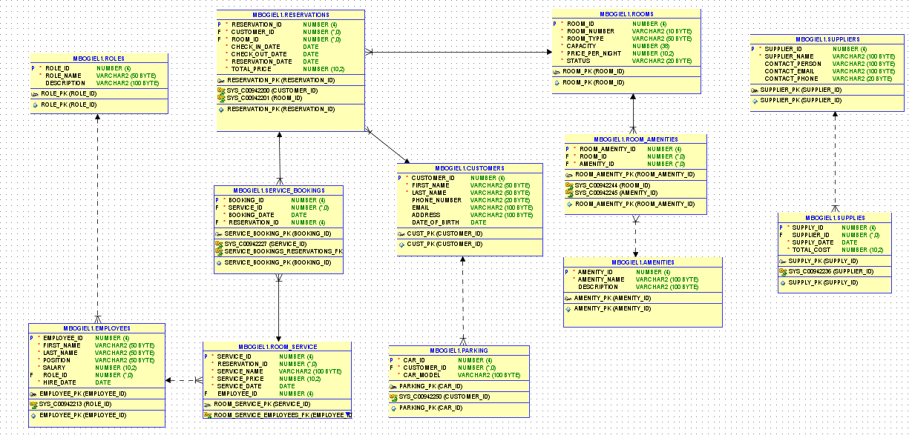

# Cześć, jestem Marek Bogiel!
Jestem studentem automatyki i robotyki na Politechnice Warszawskiej.

## Projekty studenckie
-  [Regulatory DMC](#regulatory-dmc)  
- [Gra planszowa Młynek](#gra-planszowa-młynek)
- [Baza danych dla hoteli](#projekt-bazy-danych-dla-hotelu)
- [Planowanie rozkładu jazdy dla koleji](#planowanie-rozkładu-jazdy-dla-koleji)
- [Robot Strażnik](#robot-strażnik)
- [Kontakt](#kontakt)
## Regulatory DMC
# Krótki opis  
Regulacja obiektu o wielu wejściach i wielu wyjściach, przy użyciu regulatorów PID oraz DMC. Na potrzeby projektu obiekt był opisywany przez model typu czarna skrzynka. (Można obserwować wejścia i wyjścia, ale nie wnętrze obiektu.)
# Technologie
MATLAB, regulator PID, regulator DMC
# Wyniki

Regulatory były dobre. Po dostosowaniu kodu do obsługi prawdziwego obiektu, udało się przeprowadzić regulację obiektu grzewczego uzyskując wyniki zadowalające Prowadzącego (brak uchybu ustalonego, znacznego przesterowania, a czas regulacji akceptowalny w stosunku do powolnej pracy grzałek).
# Podział pracy
Kod w MATLABIE pisałem sam, model był udostępnony przez Prowadzącego, a w zespole (Błażej Osmałek, Kacper Bielak) tylko przeprowadziliśmy dostosowanie kodu do prawdziwego obiektu.
## Gra planszowa młynek
# Krótki opis  
Celem projektu było stworzenie programu umożliwiającego grę między dwoma graczami lub graczem a komputerem w klasyczną grę młynek.
# Technologie
Python
# Wyniki

Wynikiem była gra w terminalu w której na początku gry podawało się nazwy graczy, rozmiar plansz oraz czy gracz 2 był człowiekiem czy botem.
Pierszwe zdjęcie przedstawia pola z akcjmi wpisywanymi do klawiatury.
Drugie z numeracją pól, a trzecie pozycjie pionków graczy na planszy.
# Podział pracy
Całość kodu pisałem sam.
## Projekt bazy danych dla hotelu
# Krótki opis
Celem projektu było stworzenie bazy danych do firmy hotelarskiej. Projekt obejmował stworzenie tabel, triggerów, funkcji oraz aplikacji do komunikacji z bazą.
# Technologie
SQL/Oracle, Python
# Wyniki

Prosta baza danych z funkcjami do np. zsumowania pensji dla pracowników, oraz aplikacja do komunikacji.
# Podziął pracy
Pisałem kod razem z kolegami z grupy (Janem Potaszyńskim i Jakubem Wróblewskim). Ja bezpośrednio odpowiedałem za skrypt tworzący tabele, triggery oraz schemat relacyjni i logiczny.
## Planowanie rozkładu jazdy dla koleji
# Krótki opis
Celem projektu było sprawdzenie czy metoda Q-learning nadaje się do projektowania rozkłądu jazdy pociągów.
# Technologie
Python, Q-learning
# Wyniki

Q-learning potrafił znaleźć docelowe rozwiązanie, dla małych schematów oraz średniej liczby pasażerów. Dla większej liczby pasażerów, algorytm miał problem z nauką z powodu na pewne uproszczenia środowiska.
# Podział pracy
Kod pisałem we współpracy z Kamilem Ciskiem.

## Robot Strażnik
Jest to projekt nad którym aktualnie, pracuje razem z kolegami (Tadeusz Chmielik, Mateusz Wójtowicz). Celem projektu jest zaprojektowanie robota patrolującego teren. W ramach projektu powstaje również prosta aplikacja webowa, baza danych, symulowany system Home Assistan jak i również sam robot w Gazebo.
# Technologie
Python, SQL, Proste sieci neuronowe, HTML, ROS2.
# Podział pracy
Ja odpowiadam za aplikacje internetową skłądającą się z frontendu w HTML i CSS oraz backendu w pythonie. Dodatkowo odpowiadam za dockera do symulacji Home Assistanta, czyli symulacji czujników w domu. Dodatkowo do aplikacji podpięta jest prosta baza danych stworzona przy urzyciu prostych skryptów SQL zawierająca dane o wpisach z nagraniami oraz przestrzeń na nagrania.

## Kontakt
- Email: marek160604@gmail.com
- Jeśli którykolwiek z projektów zaciekawił Pana/Panią rekrutera/rekruterkę to z chęcią udostępnie kod 
- CV

<!--

- 🔭 I’m currently working on ...
- 🌱 I’m currently learning ...
- 👯 I’m looking to collaborate on ...
- 🤔 I’m looking for help with ...
- 💬 Ask me about ...
- 📫 How to reach me: ...
- 😄 Pronouns: ...
- ⚡ Fun fact: ...
-->
